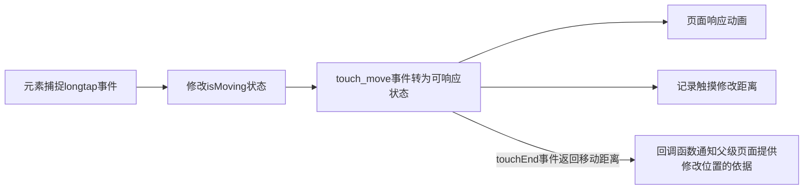

@[TOC](czh的踩坑笔记 - 微信小程序 - 拖拽操作demo)


## 拖拽功能简介
一般称拖拽是鼠标（手指）单点点击后执行移动（滑动）操作，程序主动计算滑动区域和位置，页面及时响应操作的一个功能。
**重点一** - **需要动画响应及时**
**重点二** - **需要页面展示**
~~谁还不知道啊~~

## 源码自提

  <https://github.com/czhmisaka/wxDemo_drag.git>
## 源码讲解
  1. 使用了wxs，按照官方解释，应该能为手机用户提供更好的性能。（ios端可以有2~20倍提升，安卓端无差异）
  2. 控制触摸穿透，避免组件在操作过程中对外的影响力，这边用的是catch:touchmove绑定中的一个特性，即参数（isMoving）中为空字符串时,catch事件会失效。
  3. 动画效果模拟用的时 transform，这个主要时为了避免修改dom树的排序。




## wxs文件源码

```javascript

var moveY = 0,
    y = 0;
var lock = false

// 开始移动
function touch_start(e, ownerInstance) {
    moveY = e.changedTouches[0].clientY
    ownerInstance.callMethod('changeMovingStatus', true)
    lock = true
}

// 移动中
function touch_move(e) {
    if (!lock) return
    y = e.changedTouches[0].clientY - moveY
    e.instance.setStyle({
        transform: 'translateY(' + y + 'px)',
        'z-index': 100
    })
}

// 移动位置结束
function touch_end(e, ownerInstance) {
    lock = false
    e.instance.setStyle({
        'z-index': 1
    })
    ownerInstance.callMethod('touchEnd', y)
}


module.exports = {
    touch_start: touch_start,
    touch_move: touch_move,
    touch_end: touch_end
}

```
